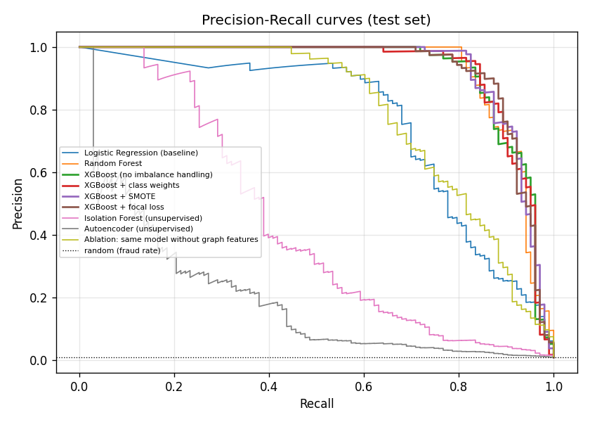
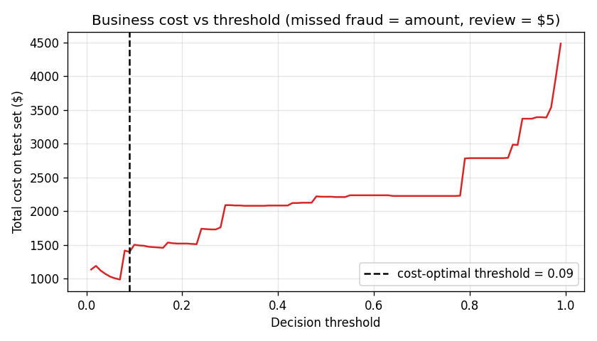
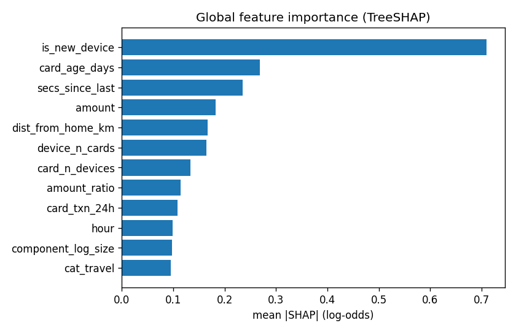
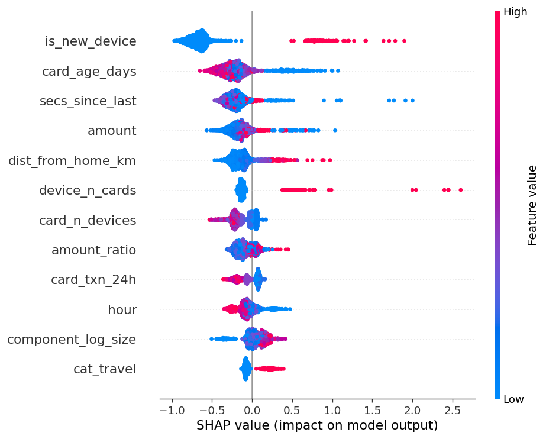
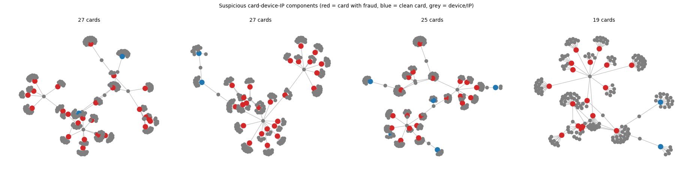
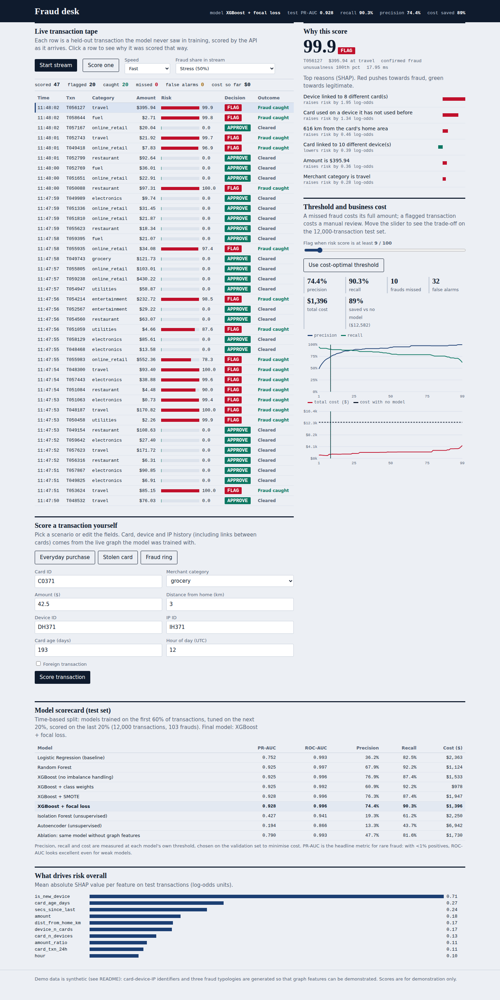

# Real-Time Fraud Detection System with Explainability

End-to-end ML project: a fraud model that is **fast, explainable, cost-aware and aware of fraud rings**, served through a **FastAPI** service with a live **dashboard**.

> Fraud is rare (<1% of transactions), costly, and regulators want to know *why* a transaction was flagged.
> This project handles all three: class imbalance, business cost, and per-transaction explanations.

**Status: complete.** 12 automated tests (one of them needs the optional `shap` package), and retraining from scratch reproduces the reported numbers exactly.

---

## 1. Features

| Capability | Implementation | File |
|---|---|---|
| Supervised: XGBoost, Random Forest, Logistic Regression baseline | All three trained and compared | `src/models.py`, `src/train.py` |
| Unsupervised: Isolation Forest, Autoencoder | Both trained (autoencoder on legitimate transactions only) and benchmarked | `src/models.py` |
| Imbalance: SMOTE vs class weights vs focal loss (compare) | All three + a "no handling" control, compared on one split **and** on 5 independent datasets (mean ± std) | `src/models.py`, `src/compare_imbalance.py` |
| Focal loss | Implemented from scratch as a custom XGBoost objective (analytic gradient, unit-tested against numerical derivative) | `src/models.py` |
| Graph features (transaction network, NetworkX) for fraud rings | Card-device-IP network; streaming graph features for the model; NetworkX for offline ring detection, validation and plots | `src/features.py`, `src/graph_analysis.py` |
| SHAP per-transaction explanations | TreeSHAP reasons for every scored transaction, in plain English | `src/explain.py` |
| Data | Synthetic transaction generator (see §2) + a ready-made script for the Kaggle credit-card file | `src/data.py`, `src/benchmark_kaggle.py` |
| Dashboard: live scoring via FastAPI | FastAPI service + live transaction tape | `app/main.py`, `app/static/index.html` |
| Risk score, top reasons for flagging | Risk 0-100, top-6 SHAP reasons with direction and size | dashboard + `/api/score` |
| Threshold slider (precision / recall / cost trade-off) | Slider over the 12,000-transaction test set with live precision, recall, misses, false alarms and dollar cost | dashboard |
| Evaluation | PR-AUC vs ROC-AUC, threshold chosen by business cost, leakage prevention (see §6) | whole repo |

Also included: graph-feature **ablation**, **bootstrap confidence interval** on PR-AUC, **probability calibration**, a **multi-seed** study, **train/serve consistency tests**, **leakage tests**, and a Kaggle benchmark script.

---

## 2. About the data

The public fraud datasets (IEEE-CIS, Kaggle credit-card) cannot be redistributed in a repository. The Kaggle credit-card file also has anonymised PCA features (V1-V28), so it has **no card / device / IP identifiers** and graph features are impossible on it.

So `src/data.py` generates **60,000 synthetic transactions over 30 days with a 0.8% fraud rate**, with:

* **Stolen-card fraud:** high amount, night-time, foreign, new device (25% are "stealthy" and look nearly normal)
* **Fraud rings:** 10 rings of 6 mule cards sharing devices and IPs, ordinary-looking amounts, burst timing
* **Card testing:** bursts of tiny transactions on one card
* **Hard negatives:** households sharing a device, travellers abroad, big legitimate purchases

**All results below are measured on this synthetic data and do not represent real-world performance.** The simulator exists so fraud rings can be studied end to end; the same pipeline also runs on the public Kaggle file through `python -m src.benchmark_kaggle` (§9), which is tested on a mock file with the same schema.

---

## 3. Results (test set = last 20% of time: 12,000 transactions, 103 frauds)

Final model: **XGBoost + focal loss + graph features**, calibrated, threshold chosen on the validation set to minimise business cost. All numbers are on synthetic data (§2).

| Metric | Value |
|---|---|
| PR-AUC | **0.928** (95% bootstrap CI 0.891 – 0.967) |
| ROC-AUC | 0.996 |
| Precision / Recall at chosen threshold | 74.4% / 90.3% (93 of 103 frauds caught, 32 false alarms) |
| Business cost on test set | **$1,396** vs **$12,582** with no model (**89% saved**) and $59,485 if everything were flagged for review |

(Assumed cost model: a missed fraud costs the transaction amount; every flagged transaction costs a $5 manual review.)

### Model comparison (single split)

| Model | PR-AUC | ROC-AUC | Precision | Recall | Cost |
|---|---|---|---|---|---|
| Logistic Regression (baseline) | 0.752 | 0.993 | 36.2% | 82.5% | $2,363 |
| Random Forest | 0.925 | 0.997 | 67.9% | 92.2% | $1,124 |
| XGBoost (no imbalance handling) | 0.925 | 0.996 | 76.9% | 87.4% | $1,533 |
| XGBoost + class weights | 0.925 | 0.992 | 60.9% | 92.2% | $978 |
| XGBoost + SMOTE | 0.928 | 0.996 | 76.3% | 87.4% | $1,947 |
| **XGBoost + focal loss** (final) | **0.928** | 0.996 | 74.4% | 90.3% | $1,396 |
| Isolation Forest (unsupervised) | 0.427 | 0.941 | 19.3% | 61.2% | $2,250 |
| Autoencoder (unsupervised) | 0.194 | 0.866 | 13.3% | 43.7% | $6,942 |
| *Ablation: final model without graph features* | 0.790 | 0.993 | 47.7% | 81.6% | $1,730 |

### What the experiments actually show

1. **Graph features matter most for rings.** Removing them drops PR-AUC from 0.928 to 0.790 and raises cost by ~24%. Ring transactions have ordinary amounts, so only the "this device is shared by many cards" signal exposes them.
2. **The three imbalance strategies are statistically tied.** On one split they differ by 0.003 PR-AUC, which is noise with only 103 test frauds. Repeating the whole experiment on 5 independent datasets (`reports/imbalance_multiseed.csv`) gives PR-AUC 0.933 ± 0.029 (focal), 0.931 ± 0.031 (SMOTE), 0.930 ± 0.031 (none), 0.927 ± 0.031 (class weights). Focal loss is nominally best on PR-AUC, and the plain model has the lowest dollar cost, but **none of the differences exceeds one standard deviation**. XGBoost already copes well with 0.8% imbalance; the strategies mostly shift the precision/recall operating point, which the cost-based threshold handles anyway. That is the conclusion the data supports.
3. **ROC-AUC is misleading here.** Logistic regression has ROC-AUC 0.993 yet only 36% precision and PR-AUC 0.752. PR-AUC separates the models; ROC-AUC does not.
4. **Unsupervised models are weak alone** (PR-AUC 0.43 / 0.19) because fraud here is not just "unusual" - the stolen-card and ring patterns overlap with legitimate behaviour. They are most useful when no labels exist; the Isolation Forest score is shown in the API as an "unusualness percentile".

Figures are in `reports/figures/`: `pr_curves.png`, `cost_vs_threshold.png`, `shap_importance.png`, `shap_summary.png`, `fraud_rings.png`.

**Precision-recall curves** - PR-AUC separates the models far better than ROC-AUC:



**Business cost vs decision threshold** - the dashed line is the threshold chosen on the validation set:



**Global SHAP feature importance** and **SHAP summary (beeswarm)**:




**Fraud rings found with NetworkX** - cards (nodes) linked through shared devices and IPs:



---

## 4. Quick start

Requires Python 3.10+. Works on Windows, macOS and Linux. No GPU, no deep-learning framework.

```bash
git clone <repository-url> && cd fraud-detection-system
python -m venv .venv
# Windows:  .venv\Scripts\activate        macOS/Linux:  source .venv/bin/activate
pip install -r requirements.txt
python run_demo.py
```

`run_demo.py` trains the model if `artifacts/` is empty, starts the API and opens **http://127.0.0.1:8000**.
Trained artifacts are already committed, so the dashboard starts in a few seconds.

Individual commands:

```bash
python -m src.train                # retrain everything (~15-20 s on one CPU core), regenerates reports/ and artifacts/
python -m src.compare_imbalance    # 5-seed imbalance study (~1-2 min)
uvicorn app.main:app --port 8000   # API + dashboard only
pip install -r requirements-dev.txt && python -m pytest -q    # 12 tests
```

Always run modules from the project root (`python -m src.train`, not `python src/train.py`).

### Lightweight by design

* All BLAS/OpenMP/XGBoost/RandomForest threads are capped at 2 (`config.py`).
* 60k rows, small trees, a tiny sklearn autoencoder (no TensorFlow/PyTorch).
* Measured on a single CPU core with 4 GB RAM: **training 15-20 s, peak 457 MB RAM; API process ≈ 233 MB, ~11 ms scoring time per transaction (~14 ms HTTP round trip)**.
* Need it even lighter? `python -m src.train --n-txn 20000 --no-plots` takes ~7 s. Set `N_JOBS = 1` in `config.py` to use a single core. Training is a one-off; the dashboard only needs `artifacts/`.

---

### Dashboard preview



*Live transaction tape with per-transaction SHAP reasons, the threshold / cost slider and the model scorecard. The screenshot was taken with the "Stress (50%)" fraud share so that flagged rows are visible; the realistic fraud rate is 0.8%.*

## 5. Architecture

```
 transactions ──► FeatureStore (time-ordered, leakage-free)
 (card, device,      ├─ stateless : amount, hour, night, foreign, distance, card age, category
  IP, amount …)      ├─ velocity  : new device?, txns in 1h / 24h, gap since last, amount vs card average
                     └─ graph     : cards per device, cards per IP, devices per card, component size
                                    │
        time-based split 60 / 20 / 20 (train / validation / test)
                                    │
   train: LogReg · RandomForest · XGBoost × {none, class weights, SMOTE, focal} · IsolationForest · Autoencoder
                                    │
   best XGBoost variant (validation PR-AUC) ─► Platt calibration (validation) ─► cost-optimal threshold (validation)
                                    │
   artifacts/ ─► FastAPI  /api/score  ─► risk score + TreeSHAP reasons + anomaly percentile  ─► dashboard
```

**The same `FeatureStore` code runs in training and in the API**, so there is no train/serve skew. The graph is maintained incrementally with a union-find structure (O(1) per transaction); NetworkX is used offline to build the full card-device-IP graph, to **verify** the union-find component sizes (checked on every training run and in tests) and to find and draw suspicious rings.

### Explanations (SHAP)

Per-transaction reasons use XGBoost's native TreeSHAP (`pred_contribs=True`), the same algorithm as `shap.TreeExplainer`, without loading numba/shap at serving time (lighter for an old laptop). `tests/test_pipeline.py` asserts the two give identical values and that contributions + bias reproduce the model margin. The official `shap` package is used for the beeswarm figure when installed. Example:

> **Fraud ring preset → risk 99.9, FLAG.** Device linked to 6 different cards (+2.49) · Card is 75 days old (+1.12) · IP address linked to 6 different cards (+0.88)

---

## 6. Design decisions and evaluation

* **PR-AUC vs ROC-AUC.** With <1% positives, ROC-AUC is dominated by the huge negative class: logistic regression scores 0.993 ROC-AUC with 36% precision. PR-AUC (average precision) tracks what analysts feel - how many alerts are real.
* **Threshold by business cost, not 0.5.** A missed fraud costs its amount; a review costs $5 (assumed). The threshold is picked on the *validation* set by minimising that cost and is *reported* on the test set. Scores are Platt-calibrated first so the threshold is meaningful across model types (SMOTE and class weights distort probabilities). The dashboard slider shows the U-shaped cost curve.
* **Data leakage - what is prevented.**
  1. *Time-based split* instead of random shuffling (no future information in training).
  2. *Streaming features*: every feature uses only earlier transactions; a test proves features of the first k rows are identical whether or not later rows exist.
  3. *No label-derived features* (no target encoding); labels are only used for offline ring *reporting*, never as model input.
  4. *SMOTE applied to the training fold only*; the autoencoder is fit on training legitimate rows only.
  5. *Threshold and calibration fitted on validation*, evaluated on untouched test data.
  6. *Train/serve parity test*: online `commit=False` scoring equals the offline features.
* **Focal loss.** It down-weights easy negatives by (1 - p)^γ so the gradient focuses on hard cases. Implemented as a custom XGBoost objective with an analytic gradient (verified numerically) and a numerically estimated Hessian clipped for stability (γ = 2, α = 0.75 for the fraud class). On this data it is tied with the other imbalance strategies.

### Limitations

* All data is synthetic, and the cost model ($5 review, loss = transaction amount) is an assumption.
* The test set contains only 103 frauds, so single-split numbers are noisy; the multi-seed study and the bootstrap confidence interval quantify this.
* No concept-drift monitoring, authentication or rate limiting.
* The graph grows forever; a production system would age out old edges.
* Labels arrive late in real life (chargebacks take weeks); here they are available immediately.
* Focal-loss hyper-parameters were not tuned.

---

## 7. API

| Method & path | Purpose |
|---|---|
| `GET /` | Dashboard |
| `GET /health` | Status, model name, threshold |
| `POST /api/score` | Score one transaction (`?commit=true` also updates the live graph state) |
| `GET /api/sample?fraud_ratio=0.15` | Replay a random **held-out test** transaction, scored |
| `GET /api/presets` | Three ready-made scenarios (everyday, stolen card, fraud ring) |
| `GET /api/metrics`, `/api/curve`, `/api/importance`, `/api/meta` | Model comparison, threshold curve, global SHAP, metadata |
| `GET /docs` | Interactive Swagger UI |

```bash
curl -X POST http://127.0.0.1:8000/api/score -H "Content-Type: application/json" -d '{
  "card_id":"C0001","merchant_category":"electronics","amount":950,
  "device_id":"DNEW-1","ip_id":"INEW-1","is_foreign":1,"dist_from_home_km":480,"card_age_days":400}'
```

Response (abridged): `{"risk_score": 100.0, "decision": "FLAG", "threshold": 0.09, "anomaly_percentile": 100.0, "latency_ms": 11.6, "reasons": [{"text": "Card used on a device it has not used before", "shap": 1.88, "direction": "increases risk"}, ...]}`

Inputs are validated (unknown category, non-positive amount, etc. return HTTP 422). Scoring is read-only by default, so repeated calls give identical results.

---

## 8. Dashboard guide

* **Live transaction tape** – press *Start stream*; held-out transactions are scored one by one. Each row shows risk bar, decision and outcome (*fraud caught / missed, false alarm, cleared*). Click any row to see its explanation. "Fraud share" lets you raise the share of frauds for a livelier demo (realistic 0.8% is also available).
* **Why this score** – risk 0-100, top SHAP reasons as red (towards fraud) / green (towards legitimate) bars, unusualness percentile, latency.
* **Threshold and business cost** – the slider re-labels the whole tape instantly and shows precision, recall, misses, false alarms, dollar cost and savings; the green dashed line marks the cost-optimal threshold.
* **Score a transaction yourself** – presets or free-form input.
* **Model scorecard** and **global feature importance**.

The dashboard is one static HTML file with no CDN dependencies, so it works offline.

---

## 9. Using the real Kaggle data (optional)

1. Download `creditcard.csv` from <https://www.kaggle.com/datasets/mlg-ulb/creditcardfraud> into `data/`.
2. `python -m src.benchmark_kaggle`

This trains the baselines, the four XGBoost strategies and Isolation Forest on the flat features (no graph - the file has no identifiers), with the same time-based split, calibration and cost-optimal threshold, and writes `reports/kaggle_benchmark.csv`. For IEEE-CIS you would map `card1-6`, `addr`, `DeviceInfo`, `P_emaildomain` to `card_id`/`device_id`/`ip_id` in a new loader; the `FeatureStore` then works unchanged.

---

## 10. Repository layout

```
config.py                  all settings (CPU threads, split, costs, focal-loss parameters)
run_demo.py                train if needed + start API + open browser
src/data.py                synthetic transaction + fraud-ring generator
src/features.py            leakage-free streaming FeatureStore (velocity + graph features)
src/models.py              focal loss, XGBoost wrapper, SMOTE / class weights, baselines,
                           Isolation Forest, autoencoder, calibration, cost-based threshold
src/train.py               end-to-end pipeline, reports, figures, artifacts
src/explain.py             TreeSHAP reasons in plain English
src/graph_analysis.py      NetworkX ring detection, validation and plots
src/compare_imbalance.py   multi-seed comparison of imbalance strategies
src/benchmark_kaggle.py    optional Kaggle benchmark
app/main.py                FastAPI service
app/static/index.html      dashboard
tests/test_pipeline.py     12 tests (leakage, parity, focal gradient, SHAP, NetworkX, API)
artifacts/                 trained model, calibrator, feature-store state, replay set
reports/                   metrics.json, model_comparison.csv, imbalance_multiseed.csv,
                           suspicious_components.csv, figures/
```

## Author

**<Your Name>** · GitHub: <your-github-link> · LinkedIn: <your-linkedin-link>

## License

MIT
